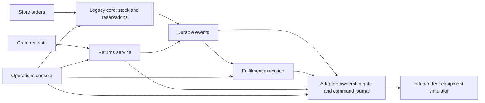

# Cutover

A local modernization lab for grocery fulfilment and reusable-crate returns.

Cutover explores a practical architecture problem: how to move task coordination out of a database-heavy legacy system while warehouse work keeps flowing, then reuse the platform for a second product.

**Current status: implementation in progress.** The latest full backend run passed 146 component checks, including 1,000 persisted SQL/Java scheduling comparisons, durable migration proof and real filesystem-pressure guards. Real process checks demonstrate zone migration, reversal and an independent returns product. [Application restoration](docs/evidence/restore-2026-09-08.md) verifies six database imports, original-event replay and guarded release in 10 minutes 49 seconds; an older checkpoint correctly quarantines later physical work with missing intent. Migration latency failures remain visible in the [migration evidence](docs/evidence/zone-migration-2026-09-08.md). Prepared offline operation, sustained load and the final acceptance bundle remain in development. Follow the [implementation ledger](docs/planning/implementation-progress.md) for evidence and limits.

The project will run entirely on one development machine. Equipment and business data are synthetic. GitHub hosts the source; builds, tests, and deployments are invoked locally, with no CI/CD.

## What the project will demonstrate

| Architectural question | Planned evidence |
| --- | --- |
| How do you modernize incrementally? | A working legacy baseline, characterization tests, extracted task service, and deterministic shadow comparison. |
| How do you change ownership safely? | A zone drains before cutover; an adapter rejects stale owners; business rollback is separate from image rollback. |
| What happens when equipment executes but its response is lost? | Stable command IDs, an independent simulator journal, and reconciliation without a duplicate movement. |
| Can a second product reuse the platform? | A smaller crate-returns service with its own business data and shared operating conventions. |
| Can the system explain failures? | Operational dashboards, durable recovery audit, failure scenarios, and backup/restore evidence. |
| Can a reviewer reproduce it? | A tested local quickstart and an offline prepared demonstration, once implemented. |

## Architecture at a glance

The legacy scheduler and new execution service coexist during migration. Each owns its tasks; the core keeps stock ownership. The adapter is the sole route to simulated equipment. The detailed plan shows the baseline, coexistence, data boundaries, and local deployment.

**Planned stack:** Java 21, Spring Boot, jOOQ, PostgreSQL, RabbitMQ, Keycloak, React/TypeScript, kind with Calico, OpenTelemetry, Prometheus, Grafana, and Tempo.

## Review the design

| Document | What to look for |
| --- | --- |
| [Implementation plan](docs/planning/implementation-plan.md) | Workflows, service/data ownership, contracts, migration protocol, local platform, recovery, and phased build order. |
| [Research and sources](docs/research/pre-development-research.md) | Verified compatibility, technology tradeoffs, primary references, and what still needs runtime proof. |
| [54 acceptance scenarios](docs/planning/acceptance-matrix.md) | Observable completion criteria for correctness, failures, migration, security, offline mode, and usability. |
| [Local machine readiness](docs/research/local-machine-readiness.md) | Installed tools, missing kind CLI, resource constraints, and port isolation. |
| [Owner decision record](docs/planning/open-decisions.md) | Confirmed project name, MIT license, and development readiness. |
| [Implementation handoff](docs/planning/goal-handoff.md) | The scope and completion contract for the future development goal. |

For a quick review, read the opening sections of the implementation plan, its cutover/rollback protocol, and scenarios A18, A29–A35, and A46–A48 in the acceptance matrix.

## Development and demonstration

The planned progression is: working legacy workflow → reproducible local platform → reliable integration → shadow comparison and zone cutover → independent returns product → failure, restore, and offline evidence.

The eventual demonstration will submit orders, compare schedulers, migrate a zone, run both products, lose an equipment response, restart a consumer, and restore an earlier application checkpoint while preserving the simulator's physical history.

The current backend test suite requires Java 21 and a working Docker Linux engine. On Windows, run `./mvnw.cmd -B -ntp test` from the repository root. Maven and test images are acquired on the first run; tests create and clean up their own disposable containers. This is a development check, not the final demonstration quickstart.

The [development baseline guide](docs/operations/development-baseline.md) provides the current build/start/check/stop commands and explains the process verification scope.

The [local platform guide](docs/operations/local-platform.md) describes the current kind deployment, console sign-in and optional local diagnostics.

The final quickstart will provide verified platform setup, a 10–15-minute walkthrough, screenshots, cleanup instructions, and measured results tied to a commit.

## Scope and limits

This is an independent portfolio project using original code and synthetic data. It does not operate real machinery, implement a complete warehouse-management system, or claim production high availability. Multiple services on one computer share a hardware failure domain.

Licensed under the [MIT License](LICENSE). Third-party components retain their own licenses.
