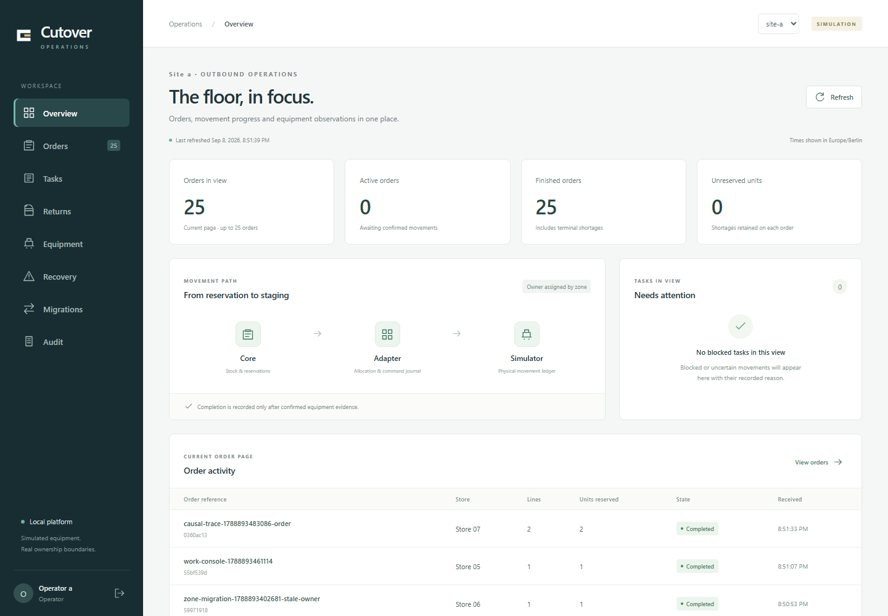
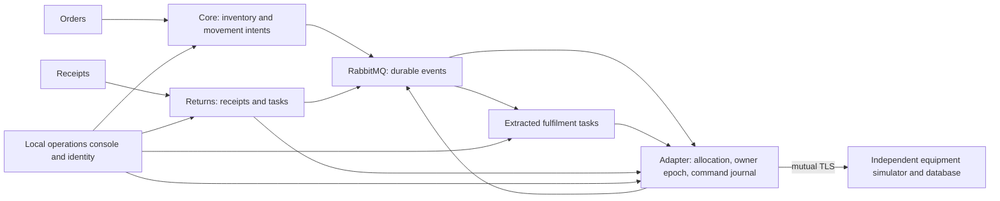

# Cutover

**Move scheduling out of a working legacy system while warehouse work continues.**

Cutover is a local portfolio lab for grocery fulfilment and reusable-crate returns. Orders reserve synthetic stock, then move through independently owned tasks to simulated equipment. Returns reuse the platform with their own receipts, coordinator and database.

Java 21 · Spring Boot · jOOQ/PostgreSQL · RabbitMQ · React/TypeScript · Keycloak · kind/Calico · OpenTelemetry



**Status: final acceptance verification in progress.** The [complete reviewer walkthrough](docs/evidence/reviewer-walkthrough-2026-09-08.md) passed all six commands in 4 minutes 49.5 seconds, with five populated console captures. Working evidence also covers owner migration/reversal, independent returns, unknown-command recovery, process failures, restoration and prepared offline operation. The latest full load completed all 3,300 movements once but missed the dispatch target; renewed sustained-load qualification remains open. The [implementation ledger](docs/planning/implementation-progress.md) records the measured results and failed attempts.

The application runs entirely on one machine with synthetic data and equipment. GitHub hosts source; builds, tests and deployment are invoked locally. There is no cloud runtime, CI/CD or hosted authentication.

## What to review

| Engineering problem | Implemented behavior and evidence |
| --- | --- |
| Preserve a working legacy system | Characterized SQL reservation/priority routines, retained task identities and a guarded [task-creation boundary](docs/evidence/assignment-boundary-2026-09-08.md). |
| Extract scheduling without guessing equivalence | [1,000 persisted identical-input comparisons](docs/evidence/shadow-2026-09-08.md) between SQL and Java; a separate shadow identity cannot dispatch. |
| Switch one zone safely | Finite allocated-work drain, reconciled proof, atomic owner/epoch change and stale-owner rejection. [Migration evidence](docs/evidence/zone-migration-2026-09-08.md). |
| Handle a lost equipment response | Immutable command IDs, an independent physical journal and [supervised investigation](docs/operations/command-investigation.md) with one physical/business effect. |
| Reuse the platform for another product | [Returns](docs/evidence/returns-2026-09-08.md) owns its tables and models; it continues through an unrelated outbound-lane fault. |
| Recover older application data honestly | [Six-database restoration](docs/evidence/restore-2026-09-08.md), original-event replay and reconciliation against unchanged physical history. Missing later intent stays quarantined. |
| Run the prepared lab offline | [Executed offline walkthrough](docs/evidence/prepared-offline-2026-09-08.md): login, both products, recovery, whole-lab restart, cached image rollback and populated dashboards under scoped external-egress denial. |
| Inspect the actual product | [Reviewer walkthrough and console gallery](docs/evidence/reviewer-walkthrough-2026-09-08.md): orders, returns, retained task history and migration proof from the running local system. |

## Two-minute architecture



The core keeps stock ownership. Each task owner has its own database and consumes versioned assignments; the adapter is the only equipment gateway. Legacy and extracted coordinators coexist behind that ownership gate. A separate shadow deployment compares decisions without dispatch authority.

The [architecture guide](docs/architecture/overview.md) shows the baseline, coexistence, extracted system, trust boundaries and local resource tradeoffs. [ADRs](docs/adr) explain individual decisions.

## Run it

Use PowerShell 7 with Java 21, Node.js 24/npm, Git, kubectl and Docker Desktop's Linux engine. Keep at least 20 GiB workspace disk headroom; doctor checks the Docker VM's 10 GiB planning budget. Initial acquisition is online.

```powershell
git clone https://github.com/fullstack-nick/cutover.git
Set-Location cutover
./scripts/bootstrap.ps1
./scripts/demo.ps1 Status
```

Open [localhost:8780](http://localhost:8780). Sign in as `operator-a` using its generated password in the ignored `.local/secrets/credentials.json`. Supervisor and platform-administrator accounts have separate duties. Credentials, caches and raw evidence stay local.

Follow the [quickstart and 10–15 minute reviewer path](docs/onboarding/quickstart.md) for both workflows, comparison, migration and recovery. Bootstrap creates a fresh legacy-owned dataset; later starts preserve consumed stock and ownership changes.

```powershell
./scripts/demo.ps1 Stop
./scripts/demo.ps1 Start
```

Stop preserves data. Deliberate reset is a separate [checkpoint-backed operation](docs/runbooks/demo-lifecycle.md). The [operating guide](docs/operations/local-platform.md) links deployment, diagnostics and recovery procedures.

## Verification and measured limits

Run `./mvnw.cmd -B -ntp verify` for backend, schema, contract and real PostgreSQL/RabbitMQ checks. Disposable labelled containers require the Docker Linux engine. Runtime drivers under `tools/scenario-driver` record assertions, image identities and results in private run directories.

The full offline backend verification passed **190 checks** across 24 test classes, with zero failures, errors or skips, in **17 minutes 7 seconds**. It covers shared messaging/security, every product-owner workflow, storage pressure, bounded inbox commits, database/authentication error responses and [N/N−1 contract consumers](contracts/compatibility/README.md). [Per-class results](docs/evidence/backend-checks.json) remain separate from platform acceptance.

The latest full load qualification on the `968cad5` runtime offered two two-line orders and one receipt per second for ten minutes after 60 seconds of warm-up. All 3,000 measured movements were included: **85.9% reached durable adapter acceptance within two seconds; p99 was 8,340.798 ms**. The target is at least 99% within two seconds. A later task-created timestamp does not replace original movement eligibility. Bounded inbox transactions pass component and deployed crash/overflow regressions; no later full performance result is claimed yet.

The development host has an Intel Core i9-13900H, 32 GiB host RAM and an approximately 15.4 GiB Docker VM. Other local workloads share its CPU and disk. Recorded quiescent-checkpoint restoration took **10 minutes 49 seconds**. These are local experiments, not production guarantees.

All [54 acceptance scenarios](docs/planning/acceptance-matrix.md) are required. The [acceptance status table](docs/evidence/acceptance-results.md) distinguishes component tests, runtime checks and unresolved results. Prepared runtime/restart/rollback under external-egress denial is separate from a source build using warmed package caches.

## Scope

Cutover uses original code and synthetic data. It does not connect to real machinery or implement a complete warehouse-management system. Separate processes on one computer share a hardware failure domain; same-host checkpoints do not protect against host-disk loss. Browser access uses loopback HTTP; the equipment boundary uses mutual TLS.

Original code and documentation use the [MIT License](LICENSE). Third-party components retain their own licenses and notices.
