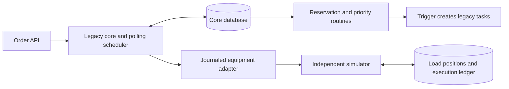
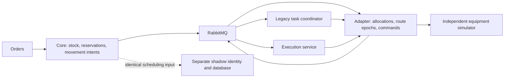
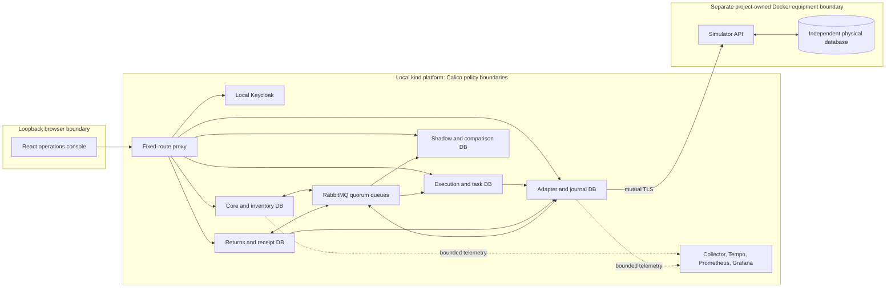

# Architecture in two minutes

Cutover moves fulfilment scheduling out of a working legacy system. Stock stays with the original inventory owner. A separate crate-returns product uses the same equipment boundary and technical starter while owning its own receipts, tasks and counters.

Everything runs on one computer. The application platform uses kind and Calico; the equipment simulator and its database run outside that cluster so application restoration cannot rewind the simulated physical world.

## 1. The working baseline

The baseline is implemented and characterized. Reservations lock stock consistently; shortages stay explicit. A completed movement consumes stock once. Its trigger-created task IDs are retained through the later registration boundary. The [initial transition procedure](../runbooks/initial-task-boundary.md) applies only when upgrading that retained baseline. Fresh final databases apply the guarded boundary migrations directly.

## 2. Coexistence during migration

The adapter allocates each movement to one owner and epoch. A task is created only from that durable assignment. Legacy and extracted task tables are separate; the two coordinators never write each other's database. The shadow process compares the SQL decision with an independent Java proposal on the same persisted input. Its token cannot create business intake, allocate a movement or dispatch a command.

A zone migration freezes new assignments, drains its finite allocated inventory, reconciles owner and equipment proof, and changes owner plus epoch under the command-admission lock. Other zones continue. The first ten movements under the new epoch provide a recorded observation sample. Unknown physical outcomes block the switch. [Migration and reversal](../runbooks/zone-migration.md) use the same durable protocol; an image rollback does not change ownership.

## 3. Extracted fulfilment and independent returns

The diagram groups each owner with its database for readability. Six separate application databases share one PostgreSQL server: core, adapter, execution, shadow, returns and Keycloak. The independent equipment database uses a second PostgreSQL process and separate volumes. This saves local resources while preserving credential and table ownership; the shared application server remains a shared availability boundary.

| Owner | Durable responsibility | Boundary that matters |
| --- | --- | --- |
| Core | Orders, stock, reservations, inventory effects, original movement intent, retained legacy tasks | Equipment completion cannot consume the same reservation twice. |
| Execution | Extracted outbound tasks and scheduling progress | An assignment belongs to one owner and epoch. |
| Returns | Receipts, classified movements, received/sorted counters and return tasks | No dependency on fulfilment tables or domain classes. |
| Adapter | Allocations, route epochs, migration proof, immutable command journal and recovery audit | Sole equipment gateway; stale owners and shadow identities are denied. |
| Simulator | World/generation identity, accepted commands, load positions and execution ledger | Acceptance and execution survive application restarts and stale application restoration. |
| Shadow | Stored input hashes, old/new outputs and differences | Independent bounded queue and capacity; observation loss cannot authorize dispatch. |

## Delivery and uncertainty

Business changes and outbox events commit together. The relay leases a bounded set of independent streams, sends persistent mandatory publications, and requires each event's positive confirmation before marking it published. Returned, nacked or unconfirmed events retain their original IDs and payloads. Durable inbox admission precedes acknowledgement; duplicate transport does not duplicate business effects. Retry exhaustion keeps evidence for audited recovery.

A lost equipment response leaves an unknown outcome. The adapter queries the same command in the same physical history. Authoritative absence can permit the same immutable command ID to be sent again; a changed world, incomplete history or previous acceptance prevents that inference. A recovery request records an investigation, not a forced physical success. See [command investigation](../operations/command-investigation.md).

## Trust and operational limits

Browser users use local Authorization Code with PKCE and in-memory tokens. APIs enforce signature, issuer, audience, time, role and site. Separate service clients, database roles, broker permissions, Calico rules and equipment certificates reinforce those checks. Runtime database identities cannot migrate schema. Secrets and raw evidence stay in the ignored local directory with restricted permissions.

Local HTTP on the browser loopback origin is an explicit lab choice. Multiple processes on one host do not provide high availability. A checkpoint restores application state into separate storage and reconciles with the still-existing physical journal. A same-host backup does not protect against loss of that host.

The [acceptance matrix](../planning/acceptance-matrix.md) defines 54 required scenarios. The [implementation ledger](../planning/implementation-progress.md) distinguishes component verification, executed platform evidence and unresolved qualification. Source structure and diagrams alone do not establish a passed scenario.
