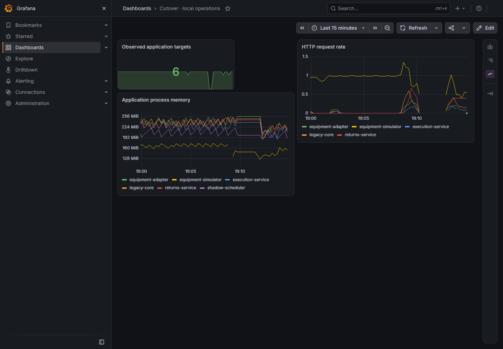

# Prepared offline runtime

`offline-1788887275782` passed on 8 September 2026 at 19:15:04 Europe/Berlin. The driver ran against the `cacff2d` application images, with Grafana's corrected 1-GiB memory limit and 768-MiB Go memory target. Exact source/build/running-image identities and the original result hash are in [runtime provenance](runtime-runs.json).

The executed sequence covered:

- Local Authorization Code/PKCE login, with an explicitly refused external navigation in the isolated browser context.
- An ambient/chilled order and a three-classification returns receipt: five matching, single physical and business effects. A selected lost equipment response recovered using its original command identity.
- Actual simulator restart and whole-lab stop/start, retaining the world, journal generation and completed products. A fresh PKCE login worked after restart.
- Verified import of the cached predecessor archive and actual adapter rollback on the expanded schema, followed by restoration of the current image.
- Ten healthy scrape targets, local trace retrieval and three populated Grafana panels. The dashboard showed six application targets, six JVM memory series and request-rate series; Grafana did not restart while rendering.

Cutover-only firewall rules denied external IPv4 destinations from the three verified Docker bridges. Real kind/simulator TCP probes failed and incremented the reject counter before and after restart. Proxy absence was recorded separately. Browser checks allowed only the documented loopback ports and recorded the deliberate external refusal. Cleanup removed the exact recorded rules and restored the original DOCKER-USER hash. This does not describe a machine-wide network disconnect.

The [runbook](../runbooks/prepared-offline.md) gives preparation, execution and recovery commands. `cache-1788887175088` separately verified 4,050 installed assets and explicit failure of an empty-file-cache fixture. Initial dependency acquisition is online; warmed Maven/npm source builds are a separate check.

Earlier attempts exposed a quoted-rule cleanup mismatch, an absent-proxy assumption, a browser probe stopped by CSP, premature dashboard capture, Grafana's inadequate memory limit, and a mutable Chromium log in the cache inventory. Their failed results remain recorded in the [implementation ledger](../planning/implementation-progress.md); none is counted as a pass.
