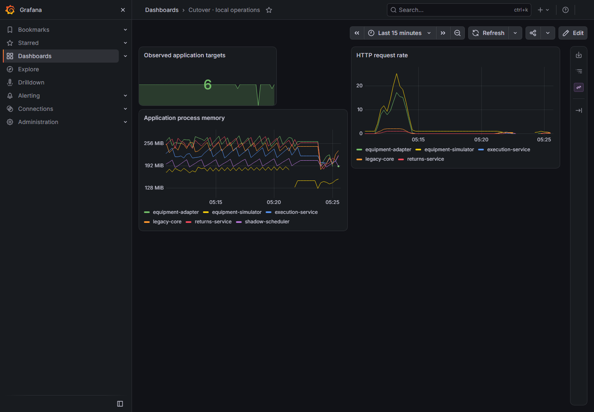

# Prepared offline runtime — current verified images

`offline-1788924041749` passed on 9 September 2026 at **05:25:52 Europe/Berlin**, using clean `beeabc1` images and driver source `e40905e`. All six cases passed. [Runtime provenance](runtime-runs.json) records exact source, build and running-image identities.

The manually invoked command was `node tools/scenario-driver/offline-smoke.mjs`. With external egress denied on the three verified Cutover Docker bridges, it exercised local PKCE login, both products, five matching single physical/business effects, recovery of a selected lost response, simulator restart, whole-lab stop/start, cached predecessor rollback and restoration of the current adapter. The world, journal generation, completed products and route authority were preserved. Isolated browser checks also explicitly refused an external navigation.

The walkthrough verified ten healthy scrape targets and local trace retrieval. Three Grafana panels rendered with six application targets, six process-memory series and populated request-rate data. The actual captured image below was inspected.

Cleanup ended in `DISABLED` state and restored the original DOCKER-USER hash. This is a scoped Cutover network test, not a machine-wide disconnect. The separate `cache-1788923962341` check verified the current assets and reported all 4,050 missing items in an isolated empty-cache fixture. The selected predecessor remains `volume-observation-1788851871227`; its original cached archive was verified before import.

The supplemental `offline-profile-1788924039727` check verifies the actual five owner/shadow tracing configurations before and after the rehearsal, restored image references after rollback, and unchanged identities, running states and restart counts for every unrelated container. The [domain/transport tracing profile](../adr/0027-domain-and-transport-tracing-profile.md) remains in effect.

Original offline result SHA-256: `80cf66e3f56d1fca5518559d4d90b77fd283d8d9e2523fcb7fdd3e82ef406395`. The earlier 9 September run `offline-1788910570635` remains in the runtime inventory, with original SHA-256 `a00f062939719e9ba7a8112e996ece880d24fe47fd508dc13a1fcc21673a622c`; the [8 September result](prepared-offline-2026-09-08.md) is also retained. This walkthrough does not qualify the separate sustained-load latency requirement.

The earlier same-day domain-tracing run `offline-1788919092593` remains retained with original SHA-256 `f31214107504395c4286d2cdbc5117512d807483ab607d38567180b4ba9fa312`. The current run adds verification of the bounded execution observation turns.
