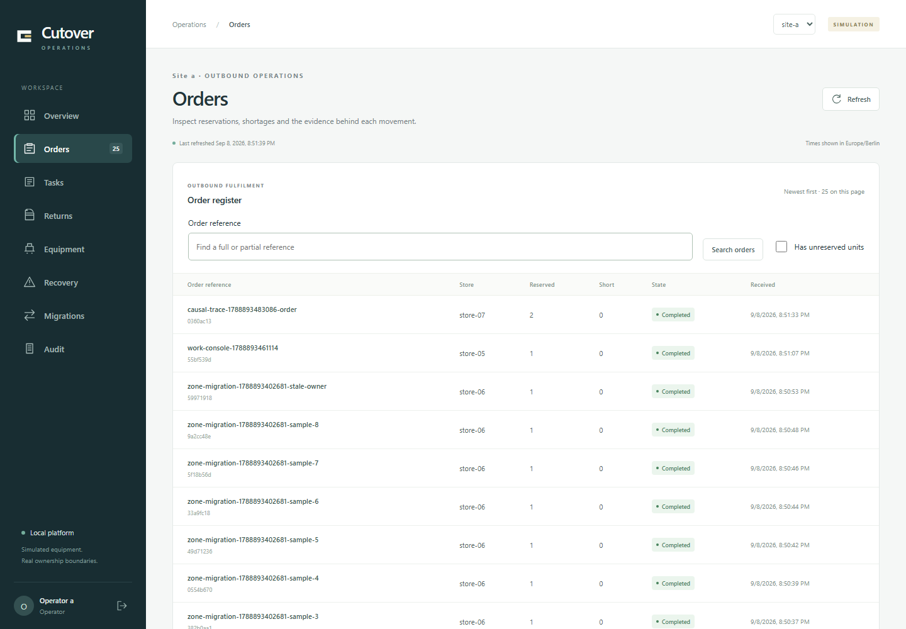
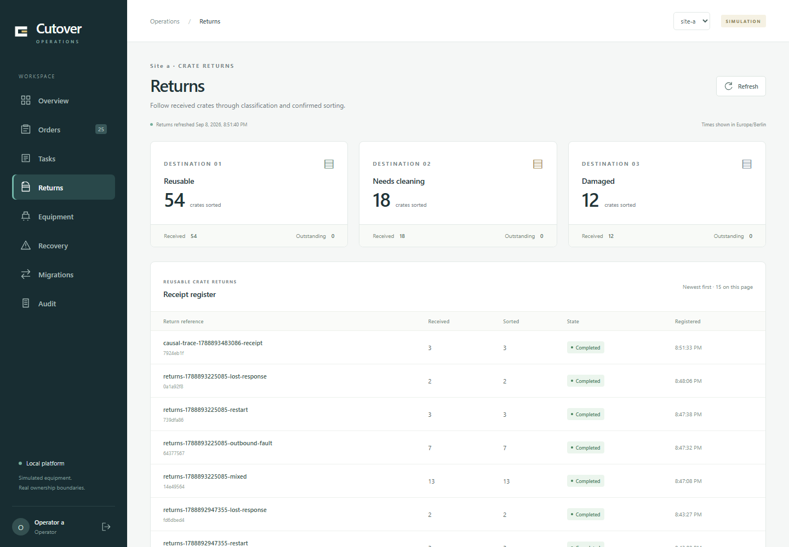
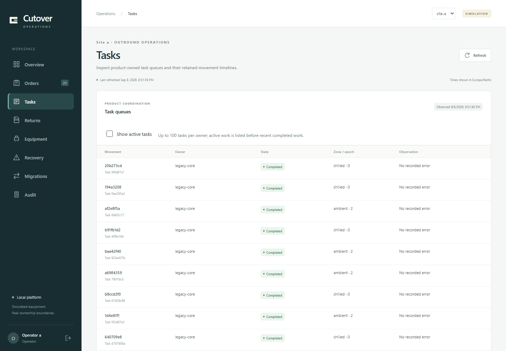
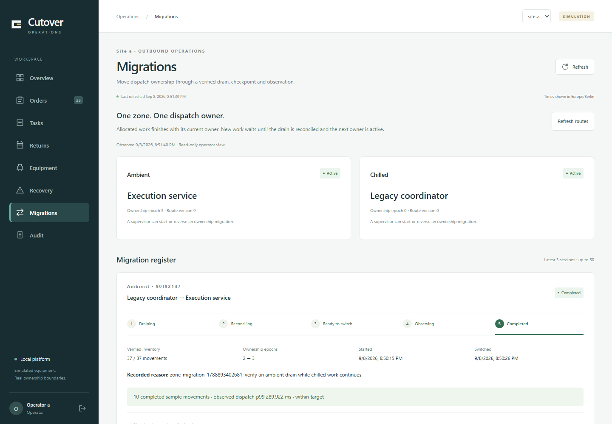

# Executed reviewer walkthrough

`reviewer-1788893203051` passed on 8 September 2026 at 20:51:40 Europe/Berlin. The six documented commands ran sequentially in **289.463 seconds** (4 minutes 49.5 seconds), followed by actual operator login and five populated console captures with no uncaught browser errors. The complete run, including preflight and capture, took 297.791 seconds.

| Reviewer step | Duration | Passed run |
| --- | ---: | --- |
| Ambient/chilled order and platform boundaries | 15.425 s | `platform-1788893209413` |
| Independent returns, lane fault and retained recovery | 67.908 s | `returns-1788893225085` |
| 1,000 persisted scheduling comparisons and shadow denial | 109.465 s | `shadow-1788893292769` |
| Ambient ownership change while chilled continues | 58.580 s | `zone-migration-1788893402681` |
| Unknown-command recovery, stale-version conflict and audit | 22.251 s | `work-console-1788893461114` |
| Both products' causal traces | 15.779 s | `causal-trace-1788893483086` |

The prepared runtime used clean `c6486a6` application images and driver source `0f1eebf`. Both outbound zones began active under legacy ownership; ambient had returned there through the ordinary supervised reversal, preserving completed history and monotonic epochs. The run ended with ambient on execution and chilled on legacy. World, journal generation and unrelated running containers were preserved. This is a retained-data rehearsal of the documented reversal path, not a claim that the dataset was empty.

Initial acquisition, building and bootstrap are separate from the command timer. `reset-bootstrap-1788887847395` verified checkpoint-backed new-world creation and the prepared-image bootstrap in **604.419 seconds**. Allow 10–15 minutes for the commands plus inspecting the console and architecture; optional human reading time is not measured by automation. Reproduce using the [quickstart](../onboarding/quickstart.md) or `node tools/scenario-driver/reviewer-walkthrough.mjs` with sufficient retained shadow-comparison headroom.

The first rehearsal passed its six commands but failed an incorrect screenshot heading selector. A repeat exposed the shadow helper's empty-table assumption after a legitimate reversal. Both failed originals remain recorded in the [implementation ledger](../planning/implementation-progress.md). The successful run used corrected, explicit populated-view checks and verified that shadow preserves historical task IDs without creating execution tasks for new legacy movements.

Exact source/build/running-image identities, child assertions and original-result hashes are in [runtime provenance](runtime-runs.json). These unedited 1440×1000 images were captured from the successful run and visually inspected:

## Overview

## Orders

## Returns

## Tasks

## Migrations

