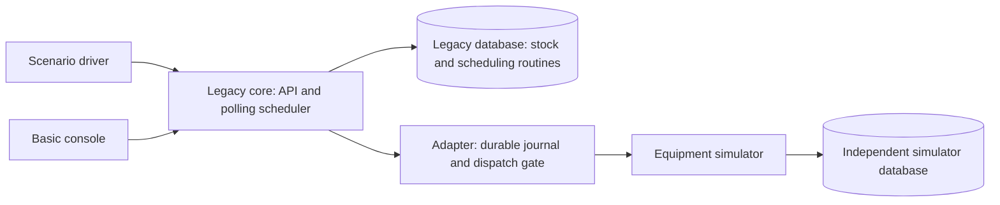
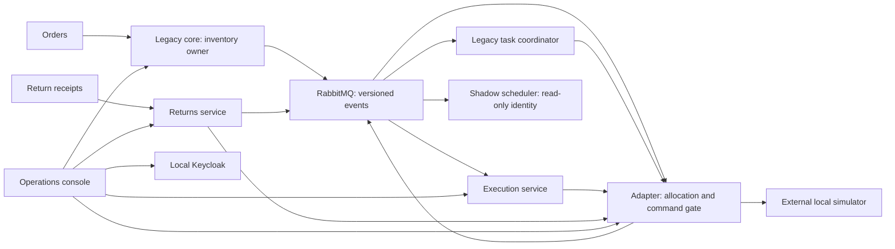

# Cutover — implementation plan

**Lifecycle update, 9 September 2026:** the owner ended development at the current baseline. The [development closeout](development-closeout.md) records the delivered work and retained A50 failure. The original plan below remains the historical specification; further implementation or qualification requires a new owner instruction.

Research baseline: 7 September 2026. Status: ready for development; owner decisions are settled, and software implementation and runtime acceptance tests have not started.

Cutover is an independent, local portfolio project demonstrating how to modernize a database-heavy grocery fulfilment system while simulated warehouse work continues. A smaller reusable-crate returns application proves that the platform supports another product without sharing fulfilment's business tables.

This is the operative plan for development. It preserves the initial scenario's technical objectives and applies the owner's subsequent requirements: independent identity, public GitHub source hosting, local execution, and no CI/CD. The supplied source is preserved separately as a byte-identical prefix of a local, Git-ignored planning archive; it is not a public project document.

Read alongside [research and sources](../research/pre-development-research.md), [machine readiness](../research/local-machine-readiness.md), [decision record](open-decisions.md), [acceptance matrix](acceptance-matrix.md), and the [future implementation handoff](goal-handoff.md).

## 1. Binding scope and project identity

| Area | Decision |
| --- | --- |
| Project name | Cutover; repository slug `cutover`. Explicitly confirmed by the owner on 7 September 2026; matches the workspace folder. |
| License | MIT for original project code and documentation, explicitly chosen by the owner on 7 September 2026. Upstream resources retain their own licenses and notices. |
| Independence | Original code, synthetic datasets, original UI and diagrams, generic domain terminology, and documented open-source dependencies. No vendor-derived product names, logos, marketing material, private interfaces, employer narratives, or claims of affiliation. |
| Execution | Windows development tools with Docker Desktop's Linux engine; final application platform in a local kind cluster. |
| Source hosting | Public GitHub repository; ordinary local Git commits and manual pushes. No runtime dependency on GitHub. |
| Delivery | Explicit local build, verification, image loading, migration, and deployment commands. No GitHub Actions, runners, Gitea, Argo CD, Flux, webhooks, scheduled builds, automatic deployment, or GitOps controller. |
| Images | Build locally and load into kind. No mandatory local registry or hosted image registry. |
| Offline | Prepared demonstration, restart, and application-image rollback work with external internet unavailable. Initial acquisition of dependencies is online. |
| Users | Portfolio reviewer, warehouse operator, recovery supervisor, platform administrator. |
| Physical scope | Simulated conveyors, picking locations, lanes, crates, and movements only. No real equipment connections or machinery-control claims. |
| Completion | All required acceptance scenarios, documentation, and an honest recorded demonstration; a successful happy path alone is insufficient. |

Git tracks local history and GitHub hosts that history. Omitting CI/CD does not remove either use. See [GitHub's explanation](https://docs.github.com/en/get-started/using-git/about-git).

The runtime must not include cloud authentication, SaaS telemetry, remote fonts, CDN scripts, external feature flags, or remote schema references. Disable optional analytics and update checks in infrastructure images. The public README contains no employer-specific rationale, including a disclaimer naming an employer.

## 2. Narrow business model

### Dataset

One active site, `site-a`; 100 fictional products; 10 fictional stores; two outbound zones (`ambient` and `chilled`); two independently blockable outbound lanes per zone; a separate returns lane; destinations `outbound-staging`, `reusable`, `cleaning`, and `damaged`. Include `site-b` as a small access-isolation fixture, without building a second warehouse.

Products use integer stock units and a temperature class, with one compatible source bin per seeded SKU. Returns use integer crate counts. No money, pricing, purchasing, billing, real customer data, expiry optimization, routing optimization, procurement, carrier planning, or full warehouse-management scope. Store IDs and SKU names must be invented.

Fixtures have a recorded random seed and UTC timestamps. Application deadlines use UTC; the console may display local time with its timezone. Inject clocks in domain tests; never change the host clock.

### Outbound workflow

1. A scenario driver or authorized service submits an external order reference, store, site, priority, and 1–10 unique product lines.
2. The legacy core validates and durably records the request. Reservation logic initially runs in PostgreSQL routines. Lock stock rows in a consistent SKU order; never allow reserved units to exceed on-hand units.
3. Reserve available units per line and record any remaining shortage. The same transaction records the reservation result and its outbox events.
4. Create one logical movement per nonzero reservation. A movement carries its reservation ID, stable synthetic load ID, source bin, required zone class, destination, and quantity.
5. The current task owner schedules and dispatches through the adapter. Only confirmed completion consumes reserved stock: decrement on-hand and reserved once, and write an inventory-ledger entry unique to the reservation/movement.
6. An order becomes `COMPLETED` only after all requested quantities have confirmed movements. After all available quantities move, a short order becomes `COMPLETED_WITH_SHORTAGE`, preserving the unmet quantities. An entirely unavailable order becomes `SHORTAGE`.

Shortages do not trigger automatic replenishment or substitution. A supervisor may cancel a wholly unstarted order; release reservations only after proving that no command was accepted or might have executed. Cancellation of partially moved or uncertain work is outside the first release; return a documented conflict and retain the audit trail. Do not release stock because a network timeout occurred.

### Returns workflow

An external return reference contains separate counts for `REUSABLE`, `NEEDS_CLEANING`, and `DAMAGED`. Record receipt totals once and create at most one movement per nonzero classification. Completion increments the appropriate destination count once. Repeated receipts cannot inflate either received or sorted totals, even when event IDs differ.

The returns service owns its receipts, counters, movement intents, and small task coordinator. It uses the adapter and platform conventions directly; it does not call the fulfilment scheduler or access its tables. Separate lane capacity lets returns continue during an outbound lane fault.

### State models

| Entity | Required states and interpretation |
| --- | --- |
| Order | `ACCEPTED`, `RESERVED`, `IN_PROGRESS`, `COMPLETED`, `COMPLETED_WITH_SHORTAGE`, `SHORTAGE`, `CANCELLED`; show blocked/uncertain child work separately. |
| Task | `PLANNED`, `READY`, `BLOCKED`, `DISPATCH_REQUESTED`, `IN_PROGRESS`, `COMPLETED`, `RECONCILIATION_REQUIRED`, `CANCELLED`. |
| Adapter command | `RECORDED`, `SEND_PENDING`, `ACCEPTED_BY_SIMULATOR`, `EXECUTING`, `COMPLETED`, `REJECTED_BEFORE_EXECUTION`, `OUTCOME_UNKNOWN`, `QUARANTINED`. |
| Return receipt | `REGISTERED`, `SORTING`, `COMPLETED`, `RECONCILIATION_REQUIRED`. |
| Zone route | `ACTIVE`, `DRAINING`, `RECONCILIATION_REQUIRED`; separate fields identify the active owner and monotonically increasing epoch. |

Enforce legal transitions in transactions with optimistic row versions. Terminal completion cannot regress when a late accepted/running event arrives. A blocked lane is a waiting condition; an unknown outcome is a knowledge gap. Neither is equivalent to a confirmed failed movement.

## 3. Architecture and ownership

Build one Maven monorepository with independently packaged applications. Responsibilities are separate where process isolation, ownership, or a second product requires it; avoid extra services for every noun.

| Component | Owns | Allowed integrations |
| --- | --- | --- |
| `legacy-core` | Orders, products, stock, reservations, inventory ledger, legacy tasks, business movement intents. | Order API; broker; adapter through its scheduling module; its own database. |
| `execution-service` | Extracted fulfilment tasks, scheduling decisions, recovery progress, shadow comparisons. | Versioned movement/assignment/status events; adapter; its own database. |
| `returns-service` | Return receipts, classifications, crate counters, its task coordinator. | Receipt API; broker; adapter; its own database. |
| `equipment-adapter` | Movement allocations, zone routing and epochs, durable command journal, simulator protocol, dispatch gate, migration sessions, authoritative command audit. | Authenticated internal APIs; broker; simulator; its own database. |
| `equipment-simulator` | Virtual load positions, equipment state, accepted commands, execution ledger, simulation world identity, deterministic faults. | Documented synthetic equipment HTTP protocol; separate database. |
| `operations-console` | Presentation and browser session state only. | HTTP APIs through a local reverse proxy; Keycloak. |
| `scenario-driver` | Repeatable input manifests and assertions/evidence. | Public and explicitly authorized test-control APIs; no business-table writes. |

One application PostgreSQL instance hosts separate databases and roles for core, execution, returns, adapter, and Keycloak. Revoke default public database access and grant only each owner's database. Migration identities can perform DDL; runtime identities cannot. Sharing a database server is a local resource tradeoff, not shared table ownership or independent infrastructure availability.

The simulator and a second small PostgreSQL instance run outside the application cluster, on project-owned Docker networks and named volumes. This lets the virtual physical world continue when application databases are restored or the kind cluster is rebuilt. It does not survive host-disk loss without a separate backup.

### Baseline



### Coexistence and target



Each business service has its own database even when omitted from this diagram. Telemetry paths are asynchronous and cannot control business success. Shadow is a deployment mode of the execution application with a separate restricted identity, not another product or shared domain library.

### Shared template

Provide a small Maven parent, technical starter, and service scaffold: configuration validation, health, JWT validation hooks, site-context handling, structured logs, trace propagation, outbox/inbox mechanics, metrics conventions, manifest defaults, and runbook skeletons. Version these internal modules deliberately.

Keep order, inventory, returns, and scheduling models out of shared modules. Share wire schemas as contracts, not persistence entities. Prove the template by scaffolding the returns application and documenting what its developer must supply.

## 4. Concrete technology baseline

The [research matrix](../research/pre-development-research.md#version-baseline) contains checked versions, compatibility evidence, and remaining execution checks. Use Java 21, Spring Boot 4.1.1, jOOQ OSS 3.21.7, PostgreSQL 18.6, Maven 3.9.16 through Maven Wrapper, React 19, TypeScript, Vite 8, and npm.

Use Spring MVC/JDBC, Spring Security's standard OAuth resource-server support, Spring AMQP, Actuator, Flyway core plus its PostgreSQL module, JUnit/Jupiter and Testcontainers versions managed by the Boot BOM. Avoid JPA alongside jOOQ and avoid reactive database access for this workload.

Generate jOOQ code from a disposable PostgreSQL database built by applying the same Flyway migrations used at runtime. Code generation must not inspect or mutate a running demonstration database. Keep generator/runtime jOOQ versions identical. Use the open-source `org.jooq` artifacts and no paid feature dependency.

Pin application dependencies, wrapper checksums, npm lockfile, infrastructure images, kind node image, Calico manifests, and tool versions. Never use a floating `latest` tag, remote Kustomize base, or unversioned download in the final scripts. Source versions are researched candidates; a real compatibility smoke test establishes the implementation lock.

Final cluster: kind 0.33.0, explicitly selected Kubernetes 1.36.4, Calico OSS 3.32.2, RabbitMQ 4.3.5, Keycloak 26.7.3, OpenTelemetry Collector, Prometheus, Grafana OSS, and single-process Tempo. Use kubectl's built-in Kustomize. No Helm, standalone Kustomize executable, service mesh, Kafka, operator stack, or Loki is required.

Serve the static console and fixed API routes with a small non-root reverse-proxy container. Expose it through a ClusterIP Service and a managed localhost port-forward. This avoids an ingress controller. An ordinary reverse proxy is distinct from the retired community ingress-nginx controller.

## 5. HTTP and message contracts

Author OpenAPI 3.1.2 and AsyncAPI 3.0 with versioned JSON Schema definitions before implementation. Validate examples, generate the console's API types, and publish local browsable API documentation with bundled assets. Use the researched NetworkNT 3.x validator with Jackson 3 for Java message validation; register all schemas locally, disable remote reference retrieval, and explicitly validate date-time/UUID formats. Keep patterns simple and bounded across Java and browser validators.

### External HTTP API

All resources are explicitly site-scoped. Principal site membership must match the route; request-body site values never grant access.

| Route | Semantics |
| --- | --- |
| `POST /api/v1/sites/{siteId}/orders` | Validate and durably record an order and idempotency record; return 202 with resource ID and status URL after commit. |
| `GET /api/v1/sites/{siteId}/orders` | Cursor-paginated filtered summaries; bounded page size. |
| `GET /api/v1/sites/{siteId}/orders/{orderId}` | Stock/shortage summary and movement progress with observation time. |
| `POST /api/v1/sites/{siteId}/return-receipts` | Durably register a receipt; return 202 after commit. |
| `GET /api/v1/sites/{siteId}/return-receipts/{receiptId}` | Received and sorted totals with outstanding movements. |
| `GET /api/v1/sites/{siteId}/tasks` | Owner-scoped task summaries; the console requests the relevant service. |
| `GET /api/v1/sites/{siteId}/equipment` | Adapter's latest observations, timestamps, staleness, and lane state. |
| `POST /api/v1/sites/{siteId}/commands/{commandId}/reconciliation` | Supervisor requests a status investigation with reason and expected row version. Does not blindly redispatch. |
| `POST /api/v1/sites/{siteId}/zones/{zoneId}/migrations` | Supervisor creates a durable drain/cutover session, expected route version, target owner, and reason. |
| `GET /api/v1/sites/{siteId}/migrations/{migrationId}` | Current phase, blockers, evidence, and outcome. |

Document separate internal allocation/command/status APIs. Management, metrics, migrations, and simulator fault controls are not ordinary public routes.

### Idempotency

Require `Idempotency-Key` for external mutations and recovery commands. Scope it by authenticated caller, site, and operation; persist a canonical payload hash and response in the business transaction. Same key and same payload returns the recorded result. Same key with changed payload returns 409.

Also enforce business uniqueness: `(site_id, source_system, external_order_ref)`, `(site_id, source_system, external_receipt_ref)`, `(site_id, movement_id)`, and one inventory effect per confirmed movement. A new idempotency key cannot circumvent an external reference. Concurrent duplicate submissions must serialize through database uniqueness/locking.

Return 400 for malformed input, 401 for missing/invalid authentication, 403 for an allowed-to-exist action without the role, 404 for resources outside the caller's site, 409 for state/version/idempotency conflicts, 413 for oversized payloads, 422 for valid JSON violating business constraints, 429 for caller rate limits, and 503 with `Retry-After` when durable admission is unavailable. Use RFC 9457 problem details and stable application error codes.

Initial bounds: 64 KiB external request body, 10 unique lines/order, 1–1,000 units/line, 1–10,000 crates/classification, bounded strings, and 100 results/page maximum. These are lab choices and must be validated before any write.

### Event envelope and ownership

Each envelope contains `eventId`, `eventType`, `schemaVersion`, `occurredAt`, `siteId`, `source`, `aggregateType`, `aggregateId`, `aggregateVersion`, `correlationId`, `causationId`, `traceparent`, and `payload`. Transport trace headers are untrusted metadata and never authorization.

| Message | Publisher | Consumer and meaning |
| --- | --- | --- |
| `OrderAccepted.v1` | Core | Observation; the request is durable, not fulfilled. |
| `StockReservationRecorded.v1` | Core | Order progress and characterization evidence. |
| `MovementRequested.v1` | Core or returns | Adapter records the intent and selects its owner through the routing gate. |
| `MovementAssigned.v1` | Adapter | Only the named owner creates an active task. Contains allocation ID, movement ID, owner, epoch, and immutable movement data. |
| `CommandAccepted.v1` | Adapter | Durable simulator acceptance is known; completion is still pending. |
| `MovementCompleted.v1` | Adapter | Verified terminal movement evidence; task and inventory/returns consumers update their own state once. |
| `CommandOutcomeUnknown.v1` | Adapter | Requires investigation; no physical retry authority. |
| `ReturnReceiptRegistered.v1` | Returns | Observation of receipt registration. |
| `ZoneOwnershipChanged.v1` | Adapter | Audit/informational notification; the adapter database remains the routing authority. |

Scheduling snapshots and comparison results have their own schemas. Commands use imperative names such as `MoveContainer`; events use past-tense names. Do not treat a broker delivery, HTTP 202, publisher confirm, or simulator acceptance as physical completion.

Use durable topic exchanges and durable per-consumer queues in a Cutover-specific virtual host, with service-specific credentials and publish/consume permissions. Application consumers cannot publish adapter-completion events. Shadow snapshots use a separate observational exchange and independently bounded relay, not a binding on the critical assignment publication. Otherwise a full shadow queue could nack a critical publish too. A snapshot-capacity failure records a comparison gap and invalidates that shadow run; it does not reject accepted business work or block active dispatch.

Within a major contract version, optional additions require compatibility tests in both directions. Renaming/removing fields, changing meaning or type, adding required fields, and adding enum values an old consumer cannot handle require a new major version or an explicitly tested rollout strategy. Retain N and N−1 fixtures; deploy tolerant consumers before new producers. Unknown future major versions go to quarantine.

## 6. Database-to-broker reliability

Write business changes and outbox rows in one local transaction. Polling relays claim rows with bounded leases; publish with persistent delivery mode, publisher confirms, and mandatory routing. Mark an event published only after a positive confirm and no return. A timeout/return/nack leaves it retryable. Broker-confirmed delivery is not proof of business processing. See [RabbitMQ confirms](https://www.rabbitmq.com/docs/confirms).

Do not keep a database transaction open over a network publish. A crash after broker acceptance but before marking the outbox row published causes a duplicate; this is an expected test case.

For each consumer, record inbox deduplication, business effect, and new outbox entries in one transaction before acknowledging the delivery. When a transient dependency or sequence gap prevents processing, durably store the payload as pending with retry metadata and then acknowledge; a local worker owns further retries. Permanent errors are durably quarantined with reason and original identifiers.

Use a unique inbox event ID plus business constraints. Retain deduplication tombstones and simulator command identities for the lifetime of the demonstration dataset. Retention cleanup must not allow an old external order or movement to execute again.

Guarantee ordering only per publisher/site/aggregate stream, using monotonically increasing aggregate versions and a relay rule that does not overtake an earlier unpublished event for that aggregate. A consumer performing gap detection must subscribe to the complete versioned stream and advance its cursor even for event types with no local business effect; filtered subscriptions need a separately defined sequence. Consumers hold gaps, request bounded repair/replay, and reject contradictory same-version contents. No claim of a global broker order. Terminal event application is monotonic and idempotent.

Retry transient infrastructure operations with exponential delay and jitter, initially 1, 2, 4, 8, and 16 seconds, then quarantine or visibly pause after the documented retry budget. Never apply this generic policy to an unknown physical outcome. No infinite requeue loops, dropping old queue messages, or acknowledging unpersisted work.

Use single-member quorum queues for the local baseline, explicitly documenting that one member supplies no host-failure redundancy. Set queue length/byte caps and `reject-publish` overflow. Prefer the application-owned durable retry/quarantine mechanism over a chain of dead-letter retry queues.

### Bounded admission and storage

Start with per-product limits of 1,000 nonterminal external requests, 10,000 unpublished events or 64 MiB of unpublished payloads, and broker queue limits of 10,000 messages or 64 MiB each. Stop new admission at 80% of a configured high-water limit to retain completion/recovery headroom. Reject before committing acceptance when a quota slot cannot be reserved.

Maintain transactional quota counters/reservations; an unlocked `COUNT(*)` followed by insertion is insufficient under concurrency. Limit total database, broker, retry, quarantine, logs, and telemetry storage. Core processing must expose a critical-storage state and stop new dispatch if it cannot journal outcomes safely. Never discard accepted business records to reclaim space.

While the broker is down, order/receipt acceptance may continue within these local limits. While the adapter is down, intent events remain durable and no commands bypass it. An equipment outage pauses only affected routes. Monitoring failure drops/buffers bounded telemetry and cannot roll back business commits.

## 7. Equipment protocol and uncertain outcomes

The simulator is an explicitly invented HTTP protocol with an OpenAPI description, not a reconstruction of industrial vendor interfaces.

| Operation | Guarantee |
| --- | --- |
| `PUT /sim/v1/commands/{commandId}` | Atomically record one immutable command; same ID/hash returns its existing state, changed content conflicts. |
| `GET /sim/v1/commands/{commandId}` | Return state, world ID, journal generation, sequence/version, and known terminal evidence. |
| `GET /sim/v1/equipment` | Return timestamped lane and load-position observations. |
| `POST /sim/v1/test-controls/faults` | Authenticated scenario-only deterministic fault configuration. |

Every command includes site, allocation/movement/load IDs, source and destination, quantity, world ID, and expected load version. The simulator permits a synthetic load's first appearance at its declared source as part of the abstraction; subsequent movements must match its current position and version. This is not a simulation of stock manufacture or a second inventory database.

Command acceptance and movement completion are separate database transactions. On completion, update virtual load position and the simulator execution ledger atomically. A stable unique command ID prevents two executions. Restart resumes accepted/in-progress work from the journal rather than memory.

The adapter persists `SEND_PENDING` before sending and uses a stable command ID derived from the logical movement, not from the retry attempt. After a timeout or crash it queries the simulator. Completed evidence updates the adapter journal and its outbox in one transaction. A delayed callback/response must not regress a completed command.

If status cannot be established, mark `OUTCOME_UNKNOWN` and stop that movement. A 404 is only a safe basis for resubmitting the SAME command ID when the simulator confirms the same world/journal generation and complete retained command history. A reset, history gap, rollback of the simulator database, or unavailable simulator does not prove non-execution.

Generate a world ID on simulator dataset creation and change it on destructive reset. Application restore preserves the live world's identity. Simulator world mismatch blocks dispatch until reconciliation. Never manufacture a new command ID to escape a duplicate check.

Faults: execution followed by lost response, delayed response beyond timeout, duplicate response, disconnect before acceptance, restart during execution, blocked lane, stale/out-of-order state, rejected precondition, and incompatible world identity. All faults accept a seed or explicit command selector, expose activation state, and can be cleared without resetting business data.

The equipment endpoint authenticates the adapter using locally generated mutual TLS certificates. Certificates/keys remain local; bootstrap uses JDK keytool and scoped files. Do not expose the simulator's administrative controls through the ordinary console proxy. Broker credentials alone never grant equipment access.

## 8. Genuine migration and rollback

### Legacy baseline

Use a real monolith with orders, stock, reservations, tasks, and equipment observations. Put reservation and priority computation into stored routines; use a trigger for initial task creation. A polling scheduler must complete an order through the simulator before adding the extracted execution service.

Characterize full stock, shortages, repeated references, concurrent reservations, blocked lanes, equal-priority ties, late acknowledgement, and restart. Preserve SQL routine behavior in tests before replacing scheduling behavior. PostgreSQL routines are a deliberate legacy teaching device.

Containerize this unchanged responsibility structure first. Record a baseline milestone and explain packaging versus architectural modernization.

### Introduce the routing boundary

Add stable movement intents and adapter allocations before enabling two schedulers. Register every existing task/movement under its legacy owner while the affected zone is paused. Reconcile the registration inventory before unpausing.

Then replace automatic legacy task creation with the movement-intent outbox boundary in an explicit migration. Legacy scheduling now creates its own task from `MovementAssigned`, still using its characterized stored priority function. Existing task IDs are retained and linked by movement ID. The new service writes only its own task tables.

The adapter consumes each movement intent and, in a transaction locking the zone route, assigns its durable owner/epoch and emits `MovementAssigned`. Unassigned intents received during draining remain pending. An event delivery to two schedulers is never ownership authority.

### Shadow

For each decision round, persist the input snapshot: ordered candidate IDs, priorities, eligibility, zone/lane state, topology version, decision timestamp, and rule version. Feed the identical snapshot into the old routine and the new pure Java scheduler. Compare selected movement/lane, ranking, and explicit rejection reasons.

Use deterministic ordering: priority descending, eligible time ascending, then stable movement ID. Do not compare live reads taken at different times. Mismatches retain both proposals and the snapshot hash. Require zero unexplained differences over at least 1,000 seeded decisions, including blocked/chilled/tie cases.

Run the shadow deployment with a separate identity that cannot allocate, submit commands, or publish authoritative movement events. Test that an attempted shadow command is rejected by the adapter, even if a software flag is incorrectly enabled.

### Controlled zone cutover

1. Supervisor creates a migration session with expected route version, target owner, and reason.
2. Adapter locks the route and switches it to `DRAINING`. New intents for that zone remain unassigned. Existing allocated work continues under the current owner.
3. Wait for ALL allocated tasks and accepted commands in the zone to finish or be conclusively reconciled. Waiting, unacknowledged, unknown, and quarantined work are blockers. Display them; do not time out into automatic force.
4. Compare intent, allocation, task, adapter-journal, and simulator evidence. Record a checkpoint hash and counts. Ensure no command can enter between the check and route change: both command acceptance and route changes lock/validate the same authoritative route row.
5. In one adapter transaction, verify the barrier again, increment the epoch, change owner, mark active, and write audit/outbox records. Release pending unassigned intents to the new owner.
6. Observe a bounded sample of new traffic, verify invariants and dispatch latency, and either finish the migration session or initiate a reverse migration.

At command intake, validate authenticated owner, site, movement allocation, current route epoch, immutable payload hash, and legal state under the route/command locks. Recheck dispatch eligibility before the journaled send. Delayed requests from the previous epoch are rejected. Retrying a completed command may return its existing outcome but cannot send it again.

This strict drain protocol prevents simultaneous old/new physical dispatch in a zone. It trades migration speed for a simple, demonstrable correctness argument. Do not introduce lease expiry as permission to repeat a physical operation.

### Two different rollback operations

Application rollback loads/redeploys the last tested image with a compatible schema. Use expand/contract migrations and keep N−1 readers working; never automatically run destructive down-migrations.

Business-ownership rollback is another drain-and-reconcile session. Already allocated tasks finish under their owner; new unassigned intents wait and are assigned after the reverse switch. Reverting an image must not silently change zone ownership or reschedule an old backlog.

Persist migration steps so a supervisor action or adapter restart resumes from the recorded phase. Concurrent migration requests, cutover during adapter crash, delayed old commands, and reversal with an unknown outcome are required tests.

## 9. Local platform, storage, and offline operation

### Profiles

| Profile | Purpose | Runs |
| --- | --- | --- |
| `dev` | Fast coding and characterization | Selected JVM services on the host, project-specific Docker databases/broker/identity/simulator as needed. |
| `demo` | Required final portfolio demonstration | One kind node, Calico, all application services, Keycloak, RabbitMQ, application databases, console, and complete telemetry; independent simulator outside kind. |
| `verification` | Reproducible integration/failure checks | Disposable project-owned test containers or a separate named kind cluster; never silently reset the live demo. |

Run one heavy profile at a time. The demo's working set is initially budgeted at approximately 10–12 GiB, with 12–14 GiB runtime headroom; measure it during implementation. This is a planning estimate, not a benchmark.

Create the cluster with `disableDefaultCNI: true`; install pinned Calico manifests before scheduling applications. Use Calico's standard iptables dataplane with the documented kind VXLAN setup, without introducing an eBPF experiment or external BGP peering. Explicitly select a Kubernetes version within Calico's tested range. Inspect host/VPN/Docker routes before choosing non-overlapping pod/service CIDRs.

Use namespaces for apps, platform, and observability; default-deny ingress/egress and an explicit connection matrix. Permit DNS over UDP/TCP, required broker/database/API/JWKS paths, metrics scrapes, telemetry export, and the simulator path. Verify policies by observed allow/deny traffic; YAML presence is not evidence.

The simulator joins only a project-owned equipment network and the required kind network connection. Discover its actual Docker address during bootstrap and render a selectorless Kubernetes Service plus EndpointSlice for it. Regenerate that endpoint after simulator recreation; hostname alone is not cross-network discovery. Restrict adapter egress to the discovered endpoint and use mutual TLS to authenticate it.

Bind user-facing access to `127.0.0.1:8780`. Propose optional localhost management forwards on 8781–8785, only when explicitly invoked; preflight checks availability. Do not bind infrastructure ports to all interfaces. Never change a user's hosts file or install a system trust root merely to run the demo.

Use a single browser-visible origin: console, fixed API paths, and Keycloak at `/identity`. Pin the issuer to `http://localhost:8780/identity/realms/cutover`; internal APIs use a separately configured reachable JWKS endpoint while still validating that exact issuer and audience. Treat localhost HTTP as a documented single-machine lab choice; it does not demonstrate end-to-end browser TLS.

### Persistence and recovery boundaries

Use PVCs backed by the kind node's local-path storage for the application database, broker, and needed telemetry. Their files stay in the Linux container filesystem, not directly on the Windows source directory. Prove pod/process-restart persistence with a marker and database check. Deliberately treat cluster deletion as loss of these application volumes: recover from exported backups rather than relying on undocumented Docker volume attachment tricks.

Keep simulator database volumes separate from application-cluster state. Export database backups and manifests outside the kind node. PostgreSQL 18 images changed their default data layout: configure and verify the selected PGDATA and volume mount, rather than copying a pre-18 path.

Pod/process restart preserves PVC data. Cluster deletion, host failure, backup restore, and simulator reset are separate scenarios with separate guarantees. A local volume or backup on the same host is not protection against host-disk loss.

Lifecycle commands target `cutover`-labelled resources and an explicit kubeconfig/context. Normal `stop` preserves data. Destructive reset is a separate, clearly labelled command that verifies exact resources and paths and requires deliberate invocation. Never use unscoped Docker prune, volume deletion, or a user's default Kubernetes context.

### Manual build and deployment contract

Planned commands below do not exist yet:

1. `doctor`: report tools, Docker connection, memory/disk, ports, conflicting contexts, and missing cached assets.
2. `bootstrap`: download/checksum pinned dependencies, create local secrets and infrastructure, and wait for readiness.
3. `verify`: compile, contract checks, unit/integration checks, UI checks, and evidence generation; exit nonzero on failure.
4. `build-images`: create images tagged with commit and content identity.
5. `load-images`: import images into kind and verify that expected digests/tags exist on the node.
6. `deploy`: show the target context and rendered manifest diff, run controlled migration Jobs, apply Kustomize output, and wait for rollout.
7. `seed`, `demo`, `failure-suite`, `backup`, `restore`, `stop`, and explicit `reset`.

Supply PowerShell entrypoints tested on Windows and portable shell equivalents where practical. These are manually invoked scripts, not a CI/CD service. Use foreground/script-managed subprocesses or hidden helpers with PID records; avoid orphaned port-forwards and visible surprise windows.

### Offline preparation

Cache Maven distribution/plugins/dependencies, npm lockfile packages, Playwright browser revisions, all build-stage/base/runtime images, kind node image, Calico/operator images, sandbox/pause images, test helper/Ryuk images, local API-documentation assets, and manifests. Include the previous working application images for rollback.

Maintain an asset manifest with version, source, digest/checksum, purpose, and offline verification status. Docker's image store and kind's node containerd image store are separate caches; load required images into both as appropriate. Set workload pull policy explicitly and verify no remote pull is needed.

Distinguish (a) prepared offline runtime/restart, which is mandatory, from (b) rebuilding from cached source without internet, which is a separately reported check. Offline tests need the same complete cache, including test tooling. No clean-machine, never-connected installation claim.

Exercise external-egress denial on Cutover resources while retaining host/cluster internal traffic; do not disable the user's machine-wide network during automated testing. Record DNS/HTTP requests and prove login, both workflows, fault recovery, image rollback, and local dashboards still work.

## 10. Security and observability

### Access and trust

| Identity | Allowed actions |
| --- | --- |
| Operator | Read site-scoped orders, returns, equipment, and task progress. |
| Supervisor | Operator permissions plus controlled reconciliation, allowed cancellation, and migration with reason/version checks. |
| Platform administrator | Platform configuration and diagnostics; business recovery still requires the supervisor role. |
| Scenario service | Submit synthetic orders/receipts for its allowed site. Test-control permissions are separate. |
| Application services | Distinct clients, audiences/scopes, database roles, and broker credentials. |
| Shadow scheduler | Read scheduling snapshots and write comparison evidence only. |

Use browser Authorization Code with PKCE S256 via `keycloak-js`, public client, exact redirect URIs, and tokens in memory. Do not use password grants, implicit flow, client secrets in the console, or browser persistent token storage. Use standard Spring Security JWT validation: signature, issuer, audience, time bounds, roles, scopes, and site membership.

Generate local credentials; commit templates with placeholders only. Never reuse credentials from other projects. Seed fictional local users with credentials in ignored local output, not README constants. Keycloak bootstrap administration is separate from application roles.

APIs must enforce site constraints in query predicates and object lookup. Use composite site/entity foreign keys and non-owner runtime roles. The isolated `site-b` test checks guessed IDs, lists, mutations, event site mismatch, and recovery actions. Do not claim robust multitenancy merely from a frontend site selector.

Run application containers as non-root with read-only root filesystems where practical, dropped capabilities, resource limits, minimal service accounts, and no Docker socket. Calico's required elevated node privileges are an explicitly scoped infrastructure exception. Limit management endpoints and test fault controls to dedicated paths and identities.

Write a small threat model covering forged completion messages, stale-owner commands, unauthorized retries, cross-site access, malicious input, leaked secrets, public source exposure, and restoration of stale state. Require recorded tests for the applicable controls.

JWTs verified with cached signing keys may remain usable until expiry during an identity outage. New login/token refresh fails visibly; key lookup failure fails closed. Background services can exhaust cached service tokens and pause relevant authenticated calls. Do not promise indefinite operation through identity loss.

### Instrumentation

Use one intentional tracing setup: the pinned OpenTelemetry Java agent plus explicit domain spans and manual propagation where required. Avoid adding a competing tracing starter/bridge. Send OTLP traces to a bounded Collector and onward to Tempo. Use Micrometer/Actuator for Prometheus metrics and disable overlapping agent metric export, with documented trace/log correlation.

Capture order/task/movement/site/correlation IDs in structured logs and traces, not unbounded metric labels. Keep credentials, bearer tokens, personal information, and full payloads out of telemetry.

Dashboard questions: oldest accepted-order age; task dispatch delay; lane backlog; outbox age/size; quarantined deliveries; unknown commands; shadow mismatches; route owner/epoch; returns progress; successful throughput before/after deployment.

Start with a 24-hour/1-GiB Prometheus retention bound, 6-hour/2-GiB Tempo storage budget, bounded Collector queues, and rotating container logs. These are initial settings to tune from observed resource use. SQL audit records remain separate from disposable telemetry.

Use startup probes for boot/migration readiness, process-local liveness, and deliberately defined readiness. Broker or monitoring failure must not restart every application. If an API can still accept work durably, it remains reachable and reports degraded state; write endpoints return controlled rejection when admission is unavailable.

### Lab targets

Declare the measured hardware/profile, exact commit/images, seed, warm-up, concurrency, and fault-free equipment conditions. Initial workload: 2 orders/second with an average of two reserved lines plus 1 return receipt/second, for 10 minutes after warm-up; simulator has enough independent lane capacity for that offered load.

Target at least 99% of eligible tasks dispatched within 2 seconds, measured from durable task eligibility to durable adapter dispatch acceptance. Exclude explicitly blocked/draining/unknown work from that latency denominator and report its count/age separately. Report acceptance latency and end-to-end movement latency separately.

Safety invariants have zero tolerated violations: lost durably accepted work on process restart with storage intact; duplicate inventory effects; duplicate simulated physical effects; negative stock; cross-site access; overlapping dispatch owners. Lab targets are not real warehouse production guarantees.

## 11. Backup and restore

Provide two explicit recovery procedures.

**Consistent checkpoint:** pause external intake and new dispatch, drain or record outstanding work, settle outboxes/inboxes, and freeze all application database-mutating workers for the dump interval. Pause identity writes as well. Then dump every application-owned database and Keycloak plus deployment versions and routing epochs. Sequential dumps represent the same frozen business checkpoint; merely pausing HTTP intake would be insufficient. The simulator may continue, with later outcomes reconciled after the freeze. Record start/end times, unsettled command IDs, simulator world ID and observed journal high-water sequence, checksums, schema versions, and required secrets.

**Stale checkpoint experiment:** take a checkpoint, resume and execute additional work, restore application data into a separate project-owned restoration environment while leaving the simulator's physical ledger untouched. Start with dispatch disabled, compare the checkpoint with the current simulator journal, reconcile completed movements and missing business context, and only then permit dispatch.

Do not treat separate live `pg_dump` calls across services as an atomic distributed snapshot. Do not reuse RabbitMQ disk files from a live container as a backup. Recreate broker topology and replay retained, checkpoint-qualified outbox history into a clean project-specific broker/vhost; never mix stale queues with restored application tables.

Retain published outbox payloads for at least the supported backup/replay horizon, initially 7 days, and retain business deduplication identities longer than that horizon. A restored database can contain `published=true` events whose broker no longer exists; recovery must explicitly re-enqueue the checkpoint's replay range with original event IDs.

If physical execution after the checkpoint has no recoverable business intent, quarantine it and report the data-loss window; do not invent inventory or claim complete recovery. Protect backup artifacts and secrets locally, and restore to separate storage first. Never reset the simulator to make an application restore look consistent.

Target a quiescent-checkpoint restore within 15 minutes and report the measured result. RPO is the elapsed interval since the last successful checkpoint; no continuous-backup or zero-RPO claim. A same-host backup proves restoration procedure, not resilience to losing that host.

## 12. Implementation sequence and exit gates

| Phase | Work | Exit evidence |
| --- | --- | --- |
| 0. Research closeout and setup | Use the confirmed Cutover identity and MIT license; check local capacity; establish Git and the future remote; acquire and lock versions. | This research pack, accepted decisions, doctor output, MIT LICENSE, no CI/CD configuration. |
| 1. Walking legacy system | Core API, stored reservation/priority routines, trigger-created tasks, polling worker, durable simulator and minimal journaled adapter. | Complete outbound workflow; deterministic fixtures; characterization of edge cases. |
| 2. Reproducible packaging | Maven wrapper, jOOQ/Flyway generation, images, config, health, per-service credentials, development profile. | Clean local rebuild; process restart; migrations and code generation against disposable databases. |
| 3. Local platform | kind/Calico, storage, local identity, console proxy, manual deploy scripts, basic telemetry. | Real policy tests; role/site tests; persistence and local login; no external runtime calls. |
| 4. Reliability boundary | Outbox/inbox, controlled retries, durable command state, admission control, simulator faults. | Duplicate/restart/broker-outage/lost-response scenarios with database and simulator evidence. |
| 5. Extraction and shadow | Movement allocation boundary, task-table separation, independent scheduler, fixed-input comparison. | No cross-database writes; 1,000 explained comparisons; shadow denied equipment access. |
| 6. Cutover and rollback | Persistent migration sessions, strict zone drain, epoch gate, image rollback and ownership reversal. | Fault-injected cutover, old-owner rejection, restart mid-migration, reverse migration without duplicates. |
| 7. Second product | Scaffold returns service, independent receipt/counter logic, shared identity and operations. | Returns workflow and duplicates; independent DB access; unrelated lane degradation test. |
| 8. Full operations verification | Complete acceptance matrix, capacity measurement, backup/restore, offline cache and demo. | Reproducible pass/fail evidence bundle; declared SLO results; observed resource footprint. |
| 9. Portfolio finish and publication | Final console polish, diagrams, ADRs, onboarding, runbooks, screenshots, final README, public source review. | Reviewer can understand in two minutes and reproduce the documented demo; sanitized public repository. |

No phase may skip the central reliability or migration work because the interface looks finished. Keep a running completion ledger with actual checks and unresolved failures. If a researched dependency combination fails its smoke gate, make the smallest supported adjustment and record the reason rather than silently changing the architecture.

### Proposed repository structure

```text
README.md
LICENSE                         # MIT
pom.xml, mvnw, mvnw.cmd, .mvn/
apps/
  legacy-core/
  execution-service/
  returns-service/
  equipment-adapter/
  equipment-simulator/
  operations-console/
tools/scenario-driver/
platform/
  service-starter/
  service-template/
contracts/
  openapi/
  asyncapi/
  schemas/
  fixtures/
infra/
  compose/
  kind/
  kubernetes/base/
  kubernetes/overlays/demo/
  vendor/                       # pinned manifests, provenance, licenses
  versions.lock.yaml
scripts/
docs/
  planning/
  research/
  architecture/
  adr/
  operations/
  onboarding/
  evidence/                     # curated and sanitized only
.local/                         # ignored source archive, caches, credentials, raw evidence
```

## 13. Portfolio deliverables and definition of done

The final README opens with a concrete modernization problem, two workflows, a screenshot or short local recording, and what the project demonstrates. Within the first screen it states local execution, simulated equipment, the project status, and the technology core.

Provide a two-minute architecture path, a tested quickstart with exact prerequisites, a 10–15-minute demonstration script, commands to stop/reset, and links to evidence and limitations. Include measured facts with commit/date/hardware; avoid build badges without a real build service or invented performance claims.

Console screens: operations overview, orders and shortages, task detail/timeline, equipment/lane state with staleness, reconciliation queue and journal evidence, migration session with blockers/shadow differences, returns receipt progress, and audit history. Provide loading/empty/error/offline/degraded states, keyboard access, readable focus, accessible status text, and confirmation of consequential supervisor actions with a reason field.

Use browser polling with bounded intervals/backoff initially; streaming is unnecessary. Show which service owns a task and when a projection was last observed. A recovery screen must distinguish request recorded, equipment acceptance, and verified completion.

Write ADRs for task extraction, stock ownership, separate product databases, RabbitMQ/outbox, simulator uncertainty, route epochs and strict drain, local manual delivery, security/identity, bounded telemetry, and backup limits. Include baseline/intermediate/target diagrams with data and trust boundaries.

Write runbooks for broker failure, blocked lane, unknown command, poison event, identity outage, migration pause/reversal, application rollback, disk pressure, backup/restore, and offline-cache repair. Each includes detection, expected business effect, authorized action, verification, and escalation/stop conditions.

The architecture proposal records three viewpoints: legacy compatibility, second-product independence, and predictable local operations. Explain compromises rather than inventing stakeholder approval.

Completion requires the [entire acceptance matrix](acceptance-matrix.md), synthetic datasets, real screenshots/recording, a verified clean bootstrap on this host, an offline prepared demonstration, and a public source review excluding local source material, secrets, unrelated company references, and generated machine data. Release the complete portfolio implementation only with accurate status and known limitations.
